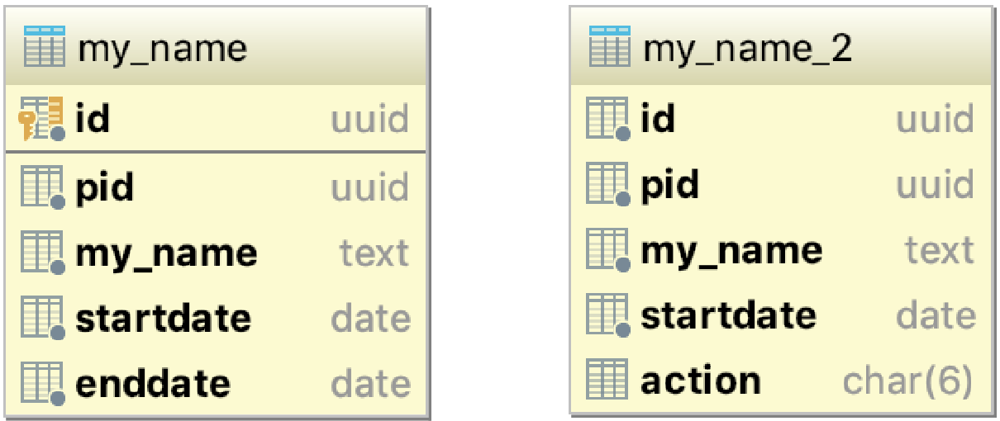

# Database Challenge

We have a table that records changes to names over time. The table has:

- a unique identifier (id) which is the table's primary key,
- a persistent identifier which stays with the record as it changes (pid)
- the name column (my_name)
- the date the record became effective (startdate), and
- the date the record was retired (enddate).

When a name is changed, the current record is retired by setting its enddate to the day the update took place and a new record is created with its startdate set to the time the update took place and its enddate set to a time in the future, in this case the 31st of December 3000.

Some example records are shown below:

id|pid|my_name|startdate|enddate  
---|---|-------|---------|-------  
c3f63bf3-32fb-426e-92c8-9452808fcf69|45341b9f-4806-41b9-81b5-ea0262bd3340|BRIAN|2016-01-01|2017-01-01
eabe1ad7-1e99-4955-87c2-bd247ec35855|7eef5eb3-1081-4a2d-b2db-493125cf9496|JOSEPH|2015-01-01|2017-02-01
cb467140-d85c-45b3-ac3b-ed4ce36366e6|45341b9f-4806-41b9-81b5-ea0262bd3340|BRYAN|2017-01-01|2018-01-01
7fc97d75-cede-41f6-a470-29a3161f0f92|7eef5eb3-1081-4a2d-b2db-493125cf9496|JOSEF|2017-02-01|3000-12-31
eb5ad6bd-961b-41c9-8784-58e64575dbfd|45341b9f-4806-41b9-81b5-ea0262bd3340|BRYANN|2018-01-01|2018-09-30

Use [My_Name.sql](My_Name.sql) to assist you in answering the following:

## Querying the table

1. We would like to obtain the current records from the database. How would you go about doing that? Please write the query.   
2. Another common scenario is getting the data at a particular point in time. For example, how would you go about getting the records that were current as at Christmas 2017?  
3. People often like to see the change in a record over time. How would you go about doing this using the structure? Could you write a query that helped us see the change in BRIAN's record sequentially over time?  
4. As the table has been used over time, there are now millions of records in it. Users are complaining that the query performance has started to get quite slow. How would you improve this based on the queries described? Can you write the code to do this?  

## Transforming the table

By demand of the database's users, we would like to change the table's structure to be more like a log of INSERT, UPDATE and DELETE actions. The current table and its desired future structure are shown below.

We included some example records in the new structure below.

id|pid|my_name|startdate|action  
---|---|-------|---------|-------  
eabe1ad7-1e99-4955-87c2-bd247ec35855|7eef5eb3-1081-4a2d-b2db-493125cf9496|JOSEPH|2015-01-01|INSERT
c3f63bf3-32fb-426e-92c8-9452808fcf69|45341b9f-4806-41b9-81b5-ea0262bd3340|BRIAN|2016-01-01|INSERT
cb467140-d85c-45b3-ac3b-ed4ce36366e6|45341b9f-4806-41b9-81b5-ea0262bd3340|BRYAN|2017-01-01|UPDATE
7fc97d75-cede-41f6-a470-29a3161f0f92|7eef5eb3-1081-4a2d-b2db-493125cf9496|JOSEF|2017-02-01|UPDATE
eb5ad6bd-961b-41c9-8784-58e64575dbfd|45341b9f-4806-41b9-81b5-ea0262bd3340|BRYANN|2018-01-01|UPDATE
eb5ad6bd-961b-41c9-8784-58e64575dbfd|45341b9f-4806-41b9-81b5-ea0262bd3340|BRYANN|2018-09-30|DELETE

1. How woud you go about transferring the data to the new structure? Could you write the query or queries?  
2. There's a problem with the example data above. What do you think it is? How would you go about fixing it?  
